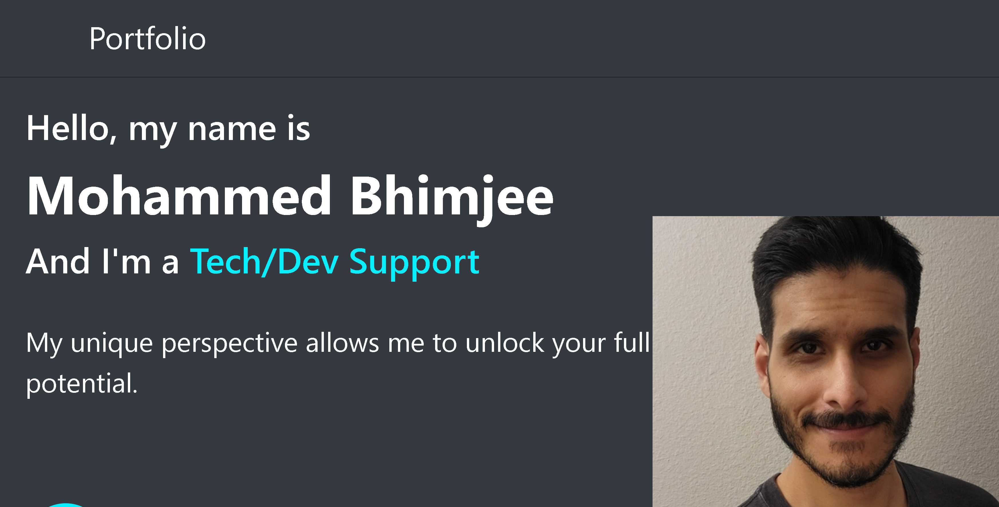

# Portfolio

## Description

  Portfolio describing my work

## Table of Contents

* [Installation](#installation)
* [Usage](#usage)
* [Contributing](#contributing)
* [Tests](#tests)
* [License](#license)
* [Questions](#questions)

## Installation

  N/A

## Usage

  Click [this link](https://chartok.github.io/portfolio-nu/) to view the portfolio.

## Contributing

  N/A

## Tests

  N/A

## License

  
  MIT License
  <https://opensource.org/licenses/MIT>

## Questions

  If you have any questions, please contact me at <m.bhimjee@outlook.com>.
  You can also find me on GitHub at Chartok.

## Credits

  Mohammed 'Asad' Bhimjee

 
